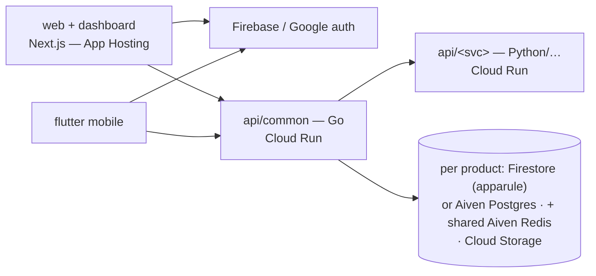

# CueLABS organization policy

## Contents

- Architecture and identity
- Delivery, telemetry, and environment (summary)
- Documentation contracts
- API conventions
- Analytics events
- Design documentation

## Architecture conventions

- The reference implementation is **`cuesoftinc/apparule`** — when in doubt
  about a convention's concrete shape, mirror it. A repo with a real
  multi-stage pipeline (a gateway + a processing service on top of `common`,
  e.g. expendit's `intake`/`process`) is the exception to the single-`<svc>`
  shape above — see "Multi-service pipelines" in `repository-and-services.md`
  for how CRUD/processing/gateway responsibilities split across three real
  services, connected by pub/sub rather than the diagram's implicit s2s call.
- Auth: Firebase Authentication, **Google sign-in ONLY** — no username/password
  signup or login anywhere in the ecosystem. Enforce at three layers:
  Email/Password provider disabled on the Firebase project; backends reject
  tokens with `sign_in_provider != google.com`; UI ships exactly one
  "Continue with Google" CTA. Sandbox identity project: `sandbox-e306a`;
  `account.cuesoft.io` is a future facade over the same Firebase project.
- Identity, profile & KYC tiers (X-10): layered on the auth standard above —
  Google sign-in stays the sole credential; tiers add profile data and
  verification, **never alternative logins**. **Tier 0 — Google identity**
  (all products): firebase_uid + Google-verified email; grants all read/basic
  use. **Tier 1 — self-attested profile & location** (captured in product
  profile/settings; sensitive PII, never logged): apparule = bio + profile
  location {city, state, country} powering proximity-ranked designer
  recommendations and delivery-address pre-fill (the delivery address itself
  stays frozen per order); expendit = tax-jurisdiction location
  (state_of_residence for individuals, registered_address for company orgs)
  which resolves the remittance authority (State IRS vs FIRS); upstat = org
  timezone (IANA) only, for report rendering and time-bucketing —
  deliberately the entire upstat requirement. **Tier 2 — provider-verified
  financial identity** (only where money moves or government filings
  generate): store provider refs + verification state, **never raw
  government IDs** — apparule designer payouts = Paystack BVN-backed bank
  resolution (the ecosystem pattern); expendit filing identity = TIN
  (+ RC number + registered address for companies) gated at filing-pack
  generation; upstat = N/A until billing enters the PRD. Rules: tiers gate
  capabilities, never sign-in; KYC state machines + error codes live in flow
  docs (apparule's kyc_incomplete/post_unavailable is the template); tier-2
  fields are high-sensitivity in every data-model.md §4 classification;
  verification is delegated to the money/filing provider — no in-house
  document review.

## Delivery, telemetry, and environment (summary)

The canonical text lives in `$cuelabs-delivery-standard`
(`cloud-and-ci.md`, `containers-and-deploy.md`,
`telemetry-and-environment.md`). Activate it for any CI, container, deploy,
telemetry, or environment-variable work. The rules an audit or bootstrap
needs without it:

- Backends deploy to GCP Cloud Run via the `cuesoft-iac` Pulumi ecosystem;
  frontends deploy to Firebase App Hosting; the Helm chart is the self-host
  path. Serverless functions are for probe/health-check endpoints only.
- One environment: `stg` (the sandbox). Doppler is the source of values.
- CI is `.github/workflows/build-and-test.yml` with one job per build-ready
  surface, plus a tag-gated `release.yml` once the deploy phase lands. Other
  workflow files need ratification.
- HTTP/JSON is the default API; gRPC and pub/sub (Kafka) are standardized
  options for documented transport needs.
- Every service instruments with OpenTelemetry, exporting OTLP directly and
  only when `OTEL_EXPORTER_OTLP_ENDPOINT` is set.
- Environment-variable names are fleet-wide; never introduce a second name
  for an existing concept.

## Documentation standard (docs/)

Every product repo carries the same docs set (GitBook Git-synced via
`.gitbook.yaml`, nav in `docs/SUMMARY.md`; doc H1s are
`<Product> — <Title>` and the SUMMARY nav label is exactly the H1 minus
the product prefix — e.g. `# Apparule — Web Implementation Standard` →
the `Web Implementation Standard` label targeting `web-implementation.md`;
labels must match
across repos):
`overview.md setup.md prd.md decisions.md roadmap.md design.md pages.md
architecture.md data-model.md api.md engineering.md deployment.md features.md
flows/ (auth + core product flows) api/openapi.yaml` + product-specific
contracts (e.g. tax-engine, capture-qc, analytics-math, query-grammar).
Claims are marked **[Current] / [PRD] / [Directive] / [Proposed] / [Decided]**;
`decisions.md` is the ratification register — other docs defer to it.
`features.md` is the granular build backlog (stable IDs, referenced in PRs as
`feat(F0-3): …`).

**Canonical section skeletons** (same H2 spine in every repo; product-specific
deep-dive sections slot between the fixed ones):
- `prd.md`: Product definition · Personas/JTBD · Functional requirements ·
  Non-goals · Brand & content · Compliance & safety · Success metrics · Open
  questions · Scope expansions (dated).
- `architecture.md`: 1 Context—current · 2 Context—target · 3 Service
  breakdown · 4 Core sequences · (product deep-dives) · Deployment view ·
  Cross-repo dependencies · dated expansion sections.
- `data-model.md`: Current entities · Target additions · Storage/identity
  mapping · Classification & retention · dated expansions.
- `api.md`: Current surface (+ topology table where multi-service) · Target
  surface · Gap analysis · Conventions · dated expansions.
- `engineering.md`: Error catalog · Authz matrix · Rate limits · Testing ·
  Logging · Acceptance · CORS contract.
- `deployment.md`: Topology · Provisioning (cuesoft-iac) · CI/CD (tag-gated,
  X-6) · Runtime contract (sizing/domains/rollback) · Not in this phase.
- `design.md`: Principles · Foundations (incl. the shared block) · Components ·
  MI catalog · Accessibility & motion · Platform parity · Figma Style Guide.
- `pages.md`: Part A home · Part B dashboard · Part C mobile · feature
  register delta. `features.md`: Phase tables (ID/unit/delivers/refs/deps) +
  cross-phase units. `flows/*`: numbered contract sections ending in
  Instrumentation & Acceptance.
- All mermaid diagrams must parse (validate with mermaid-cli before merge —
  invalid blocks render as plaintext on GitBook); no ASCII diagrams.
- Landing dual-audience rule: the product landing page (`pages.md` Part A)
  must sell to **both** contributor-developers (stack, interesting problems,
  good-first-issues, community links) and self-hosting adopters
  (data-ownership pitch, one-line install, what ships) — with an FAQ.

**Docs describe the current system** (ratified 2026-07-19): design docs are
a snapshot of what is on `main` NOW, not a changelog. Decision markers
(`[Decided …]` / `[Directive …]`) and as-built notes describing the current
construction stay; archaeology does not — once a replacement lands, clauses
like "replaces X", "drops Y", "formerly Z", references to retired legacy
trees, or pointers at Deprecated-page parking are removed in the same pass
(git history and PRs are the changelog).

## Ecosystem API conventions

- Versioned base path `/api/v1` (products) — upstat's public surfaces use
  `/v1` (events/stats/query are cross-product infrastructure).
- Error envelope `{"error": {"code", "message", "details?"}}`; codes are
  **snake_case and stable**, owned by the flow docs (never invented in code
  review). Cross-tenant access returns `404`, never `403`.
- Cursor pagination (`?cursor=&limit=`, default 50).
- `Idempotency-Key` header on any client-retryable mutation (uploads,
  payments, submissions) — retries must never duplicate.
- Rate limits per engineering.md; `429` + `Retry-After`.
- Auth: Firebase ID-token bearer (Google-only); machine identities
  (service tokens, property keys) never grant user-API access.

## Analytics events rule

Upstat's `docs/api.md` consumer registry is the **master event registry** for
the ecosystem. Events are counters + registered coarse dims only — never
measurement values, amounts, descriptions, or PII. Adding an event = update
the registry first, then instrument.

## Design documentation

Each repo's `design.md` follows the design documentation standard owned by
`$cuelabs-design-standard` (tokens with true Light/Dark modes, the shared
foundations block, component inventory, and the `MI-n` microinteraction
catalog).
