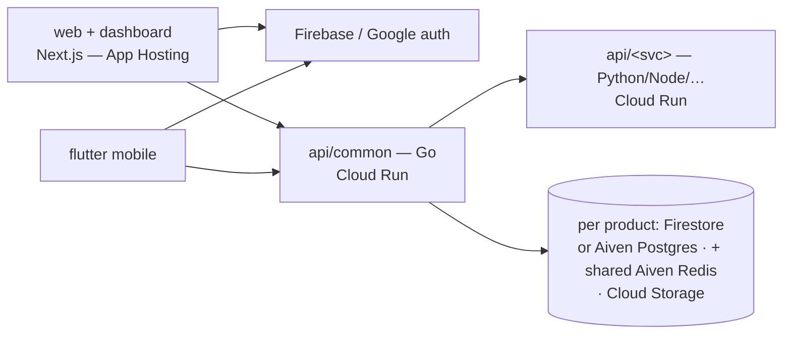

# CueLABS organization policy

## Contents

- Architecture and identity
- Shared ecosystem services
- Delivery, telemetry, and environment (summary)
- Documentation contracts
- API conventions
- Analytics events
- Design documentation

Values that each product chooses for itself (slugs, default theme, ports,
data store, profile fields) are not recorded here. See
[product-decisions.md](product-decisions.md).

## Architecture conventions

- The diagram is the default shape: one Go `api/common` plus at most one
  functional service. A product with a real multi-stage pipeline (a gateway
  and a processing service on top of `common`) may carry more; see
  "Multi-service pipelines" in `repository-and-services.md` for how the
  CRUD, processing, and gateway responsibilities split, connected by pub/sub
  rather than a direct service-to-service call.
- Auth: Firebase Authentication, **Google sign-in ONLY** — no username/password
  signup or login anywhere in the ecosystem. Enforce at three layers:
  Email/Password provider disabled on the Firebase project; backends reject
  tokens with `sign_in_provider != google.com`; UI ships exactly one
  "Continue with Google" CTA. Every product uses the shared identity project
  listed under "Shared ecosystem services".
- Identity, profile & KYC tiers: layered on the auth standard above —
  Google sign-in stays the sole credential; tiers add profile data and
  verification, **never alternative logins**.
  - **Tier 0 — Google identity** (all products): `firebase_uid` +
    Google-verified email; grants all read/basic use.
  - **Tier 1 — self-attested profile & location**: only the fields the
    product needs (for example a location for recommendations, a tax
    jurisdiction, or an organization timezone), captured in product
    profile/settings. Tier-1 data is sensitive PII and is never logged.
  - **Tier 2 — provider-verified financial identity**: only where money moves
    or government filings are generated. Store provider references and
    verification state, **never raw government IDs**. Verification is
    delegated to the payment or filing provider (for example bank resolution
    through the payment provider) — no in-house document review.
  - Rules: tiers gate capabilities, never sign-in. KYC state machines and
    their error codes (for example `kyc_incomplete`) live in the product's
    flow docs. Tier-2 fields are high-sensitivity in `data-model.md`'s
    classification section. Each product records what its tiers 1 and 2
    contain; a product may declare tier 2 not applicable.

## Shared ecosystem services

Some capabilities are provided once for the whole ecosystem by a specific
product. Depend on the **role and its contract**, never on the provider's
internals; this table is the only place the provider is named.

| Role | Contract | Provided by |
|------|----------|-------------|
| Observability gateway | OTLP receiver on 4317 (gRPC) / 4318 (HTTP) with an ingest-key header; reached through `OTEL_EXPORTER_OTLP_ENDPOINT` / `OTEL_EXPORTER_OTLP_HEADERS` | upstat |
| Product analytics events | Public `/v1/events` API (plus `/v1/stats`, `/v1/query`); the provider repo's `docs/api.md` consumer registry is the master event registry | upstat |
| Identity | Firebase project `sandbox-e306a` (Google sign-in only); `account.cuesoft.io` is a planned facade over it | CueLABS™ |
| Infrastructure | `cuesoft-iac` Pulumi ecosystem provisions Cloud Run, App Hosting, and shared stores | CueLABS™ |

A new product consumes these through configuration only. Moving a role to a
different provider is an ecosystem change to this table, not a per-product
decision.

## Delivery, telemetry, and environment (summary)

The canonical text lives in `$cuelabs-delivery-standard`
(`cloud-and-ci.md`, `containers-and-deploy.md`,
`telemetry-and-environment.md`). Activate it for any CI, container, deploy,
telemetry, or environment-variable work. The rules an audit or bootstrap
needs without it:

- Backends deploy to GCP Cloud Run via the `cuesoft-iac` Pulumi ecosystem;
  frontends deploy to Firebase App Hosting; the Helm chart is the self-host
  path. Serverless functions are for probe/health-check endpoints only.
- One environment: `stg` (the sandbox). Doppler is the source of values.
- CI is `.github/workflows/build-and-test.yml` with one job per build-ready
  surface, plus a tag-gated `release.yml` once the deploy phase lands. Other
  workflow files need ratification.
- HTTP/JSON is the default API; gRPC and pub/sub (Kafka) are standardized
  options for documented transport needs.
- Every service instruments with OpenTelemetry, exporting OTLP directly and
  only when `OTEL_EXPORTER_OTLP_ENDPOINT` is set.
- Environment-variable names are fleet-wide; never introduce a second name
  for an existing concept.

## Documentation standard (docs/)

Every product repo carries the same docs set (GitBook Git-synced via
`.gitbook.yaml`, nav in `docs/SUMMARY.md`; doc H1s are
`<Product> — <Title>` and the SUMMARY nav label is exactly the H1 minus
the product prefix — e.g. `# <Product> — Web Implementation Standard` →
the `Web Implementation Standard` label targeting `web-implementation.md`;
labels must match across repos):
`overview.md setup.md prd.md decisions.md roadmap.md design.md pages.md
architecture.md data-model.md api.md engineering.md deployment.md features.md
flows/ (auth + core product flows) api/openapi.yaml` + product-specific
contracts for the product's core domain (for example a pricing engine or a
query grammar).
Claims are marked **[Current] / [PRD] / [Directive] / [Proposed] / [Decided]**;
`decisions.md` is the ratification register — other docs defer to it. It
also records the product's values for every parameter listed in
[product-decisions.md](product-decisions.md).
`features.md` is the granular build backlog (stable IDs, referenced in PRs as
`feat(F0-3): …`).

**Canonical section skeletons** (same H2 spine in every repo; product-specific
deep-dive sections slot between the fixed ones):
- `prd.md`: Product definition · Personas/JTBD · Functional requirements ·
  Non-goals · Brand & content · Compliance & safety · Success metrics · Open
  questions · Scope expansions (dated).
- `architecture.md`: 1 Context—current · 2 Context—target · 3 Service
  breakdown · 4 Core sequences · (product deep-dives) · Deployment view ·
  Cross-repo dependencies · dated expansion sections.
- `data-model.md`: Current entities · Target additions · Storage/identity
  mapping · Classification & retention · dated expansions.
- `api.md`: Current surface (+ topology table where multi-service) · Target
  surface · Gap analysis · Conventions · dated expansions.
- `engineering.md`: Error catalog · Authz matrix · Rate limits · Testing ·
  Logging · Acceptance · CORS contract.
- `deployment.md`: Topology · Provisioning (cuesoft-iac) · CI/CD (tag-gated)
  · Runtime contract (sizing/domains/rollback) · Not in this phase.
- `design.md`: Principles · Foundations (incl. the shared block) · Components ·
  MI catalog · Accessibility & motion · Platform parity · Prototype journeys ·
  Figma Style Guide.
- `pages.md`: Part A home · Part B dashboard · Part C mobile · feature
  register delta. `features.md`: Phase tables (ID/unit/delivers/refs/deps) +
  cross-phase units. `flows/*`: numbered contract sections ending in
  Instrumentation & Acceptance.
- All mermaid diagrams must parse (validate with mermaid-cli before merge —
  invalid blocks render as plaintext on GitBook); no ASCII diagrams.
- Landing dual-audience rule: the product landing page (`pages.md` Part A)
  must sell to **both** contributor-developers (stack, interesting problems,
  good-first-issues, community links) and self-hosting adopters
  (data-ownership pitch, one-line install, what ships) — with an FAQ.

**Docs describe the current system**: docs are a snapshot of what is on
`main` now, not a changelog. Decision markers (`[Decided …]` /
`[Directive …]`) and as-built notes describing the current construction stay;
archaeology does not — once a replacement lands, clauses like "replaces X",
"drops Y", "formerly Z", references to retired legacy trees, or pointers at
Deprecated-page parking are removed in the same pass (git history and PRs are
the changelog).

## Ecosystem API conventions

- Versioned base path `/api/v1` for product APIs. Shared ecosystem services
  (see the table above) expose cross-product surfaces under `/v1`.
- Error envelope `{"error": {"code", "message", "details?"}}`; codes are
  **snake_case and stable**, owned by the flow docs (never invented in code
  review). Cross-tenant access returns `404`, never `403`.
- Cursor pagination (`?cursor=&limit=`, default 50).
- `Idempotency-Key` header on any client-retryable mutation (uploads,
  payments, submissions) — retries must never duplicate.
- Rate limits per engineering.md; `429` + `Retry-After`.
- Auth: Firebase ID-token bearer (Google-only); machine identities
  (service tokens, property keys) never grant user-API access.

## Analytics events rule

The product analytics service's `docs/api.md` consumer registry (see "Shared
ecosystem services") is the **master event registry** for the ecosystem.
Events are counters + registered coarse dims only — never measurement values,
amounts, descriptions, or PII. Adding an event = update the registry first,
then instrument.

## Design documentation

Each repo's `design.md` follows the design documentation standard owned by
`$cuelabs-design-standard` (tokens with true Light/Dark modes, the shared
foundations block, component inventory, and the `MI-n` microinteraction
catalog).
